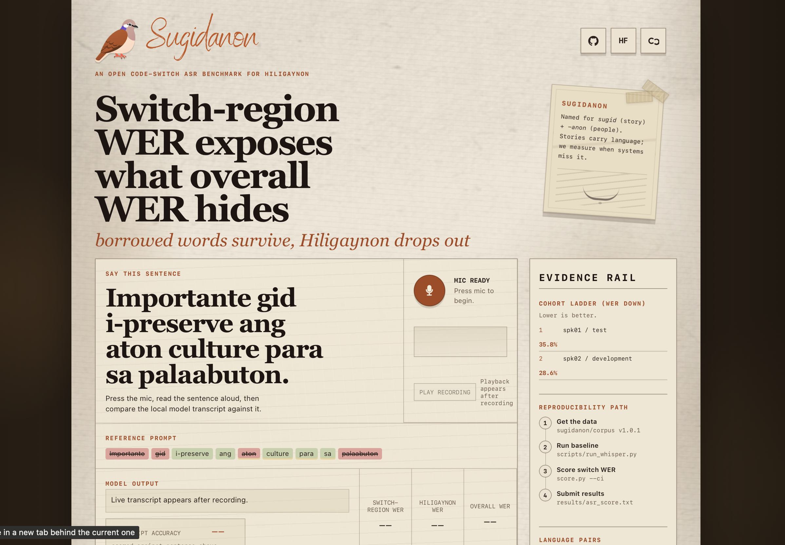

# Team Hague — Sugidanon

<p align="center">
  
  
  
  
  
  
  
  
  
  
  
</p>

---

[](https://github.com/Jazztinn/tinig-sa-liwanag/actions/workflows/benchmark.yml)

**ACM TechSprint Asteria Submission**  
**Event dates:** June 25-27, 2026

> *Measuring what gets erased. Sugidanon is an open code-switch ASR benchmark for Hiligaynon, the language of 9M+ Filipinos that speech AI has never learned to hear.*

**Live demo:**

<p align="center">
  <a href="https://tinig-sa-liwanag.vercel.app">
    
  </a>
</p>

**Open dataset — built by Team Hague (Hugging Face):**

<p align="center">
  <a href="https://huggingface.co/datasets/LauelKills/sugidanon-hil-codeswitch">
    
  </a>
</p>

```text
https://huggingface.co/datasets/LauelKills/sugidanon-hil-codeswitch
```

A dataset we built from scratch, 40 native-recorded code-switch Hiligaynon/Tagalog/English clips with per-word language tags, switch-region WER scoring, and a second 40-clip speaker extension. Recorded and reviewed by native Ilonggo speakers. CC BY 4.0.

**Reproduce the benchmark — one click, no local setup:**

<p align="center">
  <a href="https://colab.research.google.com/github/Jazztinn/tinig-sa-liwanag/blob/main/notebooks/sugidanon_colab.ipynb">
    
  </a>
</p>

Downloads the dataset, runs the ASR baseline, and prints the switch penalty on a fresh machine. No local setup.

**ASR baselines:**

```text
OpenAI Whisper:  https://github.com/openai/whisper
Meta MMS:        https://huggingface.co/facebook/mms-1b-all
```

## Team members

| Member | Primary role |
|--------|--------------|
| Legaspi, Jazztinn Kyle | Lead / pipeline, Benchmark data evaluation scripts, demo app |
| Michael C. Baterna | Schema, domain examples, HuggingFace |
| Arwin Jeremy Bumpus | Frontend / demo UI, documentation |
| De Guzman, Nimeesha | Lexicon, Tagalog/Hiligaynon bridge, review coordination |

## Acknowledgments

**Aziel Faith Agustin** — Hiligaynon (Ilonggo) speaker who reviewed the elicitation sentences and recorded all 80+ clips. The dataset's reference transcripts and audio exist thanks to their voice and review.

---

## ✦ Why this matters

> **The Philippines has 130+ languages. Most are invisible to modern speech technology.**

Hiligaynon (Ilonggo) — spoken by **9M+ people** across Iloilo, Negros, Guimaras, and Panay, and carrier of a deep oral tradition (the *sugidanon* epic chants this project is named for), is one of them. Off-the-shelf speech models are rarely even *measured* on Ilonggo, so no one had quantified where they fail.

**Sugidanon makes that failure measurable.** Its core contribution is **switch-region WER**: instead of one blunt error rate, it separates errors on borrowed English/Tagalog words from errors on the Hiligaynon matrix language. The finding is sharp and reproducible — current models transcribe the borrowed words well but miss the Hiligaynon itself.

Measurement is the first act of inclusion:

- **Overall WER hides which language failed; switch-region WER exposes it.**
- An open, per-word-tagged corpus recorded and reviewed by native Ilonggo speakers turns heritage speech — including an `oral_tradition` domain — into reusable data, **owned by the community (CC BY 4.0), not extracted from it.**
- A reproducible benchmark makes the gap fundable and fixable, and the same clips and tags can later seed STT/TTS and speech-to-speech evaluation.

> Rather than a finished consumer product, Sugidanon is a **building block** — a measuring stick and an open corpus that future developers and researchers can extend into inclusive speech systems, so every Filipino voice gets a seat at the table before it disappears.

## UN Sustainable Development Goals

Sugidanon directly supports:

<a href="https://sdgs.un.org/goals/goal4"></a>
<a href="https://sdgs.un.org/goals/goal9"></a>
<a href="https://sdgs.un.org/goals/goal10"></a>
<a href="https://sdgs.un.org/goals/goal17"></a>

## Headline results

Whisper small, `--language tl`, **1 speaker / 40 clips**:

| Metric | Value | What it means |
|--------|------:|---------------|
| Overall WER | 57.4% | Blended error rate across all tokens |
| Switch-region WER | 35.8% | Error rate on tokens within 1 word of a language switch |
| Monolingual (Hiligaynon) WER | 65.9% | Error rate on pure-Hiligaynon regions |
| **Matrix-Language Erasure Gap** | **−30.1 pp** | `Monolingual WER − Switch-region WER`: the model handles borrowed words far better than native Hiligaynon — a *negative* gap meaning the matrix language is what gets erased |

> **Matrix-Language Erasure Gap** = Monolingual Hiligaynon WER − Switch-region WER = 65.9% − 35.8% = **−30.1 pp**. Positive = model struggles at switches. Negative (our result) = model struggles with the *heritage language itself*, not the switches.

*N is intentionally small (40 clips, 1 headline speaker, 165 switch tokens / 208 mono tokens). Results are reproducible and directionally consistent with the spk02 extension (gap −10.2 pp over 40 clips), but should be interpreted as early-benchmark estimates, not large-sample statistics.*

### Error taxonomy

| Error type | Example | Where it appears |
|---|---|---|
| **Deletion** | `kahapon` → *(missing)* | Hiligaynon monolingual regions |
| **Substitution** | `nag-luto` → `nagluto` | Morphological mismatch in Hil |
| **Insertion** | extra filler token inserted | Both regions |
| **Switch confusion** | English/Tagalog token transcribed as Hiligaynon word | Switch boundary |
| **Language skip** | Hiligaynon clause entirely dropped, English retained | Monolingual region |

Deletion and language-skip dominate the monolingual region; switch-boundary substitutions are the main source of switch-region errors.

## Explorer

<p align="center">
  
</p>

## Quick start

### Dependencies

**Core benchmark** — stdlib only, no install needed:

```bash
python3 score.py --ref data/annotations --hyp data/predictions
```

**Optional — ASR baseline:**

```bash
pip install openai-whisper jiwer   # or: pip install -r requirements.txt
python3 scripts/run_whisper.py
```

**Optional — web explorer:**

```bash
npm install        # Next.js + React
npm run dev        # http://localhost:3000
```

### Run scoring

```bash
python3 score.py --ref data/annotations --hyp data/predictions
```

Expected output:

```text
Overall WER:          57.4%
Monolingual WER:      65.9%
Switch-region WER:    35.8%
Switch penalty:       -30.1 pp
  hil↔en:             40.0%
  hil↔tl:             24.4%
  tl↔en:               6.2%
```

```bash
python3 score.py --ref data/annotations --hyp data/predictions --ci
```

Expected (adds 95% bootstrap CIs):

```text
Overall WER:          57.4%  [52.1%, 62.6%]
Monolingual WER:      65.9%  [59.2%, 72.3%]
Switch-region WER:    35.8%  [29.4%, 42.5%]
```

### Run validation

```bash
python3 scripts/validate.py --kind asr --dir data/annotations
```

Expected output:

```text
Validating 40 annotation files...
✓ All 40 files pass schema validation.
```

### Drift gate

```bash
python3 scripts/freeze_benchmark.py --verify
```

Expected output:

```text
MANIFEST v1.0.1 — 40 annotations, 40 audio files
All hashes match. Benchmark is frozen and unmodified.
```

Fails loudly if any annotation or audio file has changed since the freeze.

### Run tests

```bash
python3 -m unittest discover -s tests
```

Expected output:

```text
..........
----------------------------------------------------------------------
Ran 10 tests in 0.4s

OK
```

### Full release pipeline

```bash
python3 scripts/build_release.py --overwrite
```

Runs validate → score → freeze verify → build web JSON → package dataset in one shot.

## Annotation labels

Per-word `lang` tags and transcripts carry a `gold_status` field:

| Label | Meaning |
|---|---|
| `reviewed` | Confirmed by a native Hiligaynon speaker. Safe to treat as ground truth. |
| `seed_unverified` | AI-assisted or team-drafted; plausible but not yet speaker-confirmed. Use with caution; do not treat as authoritative language data. |

All 40 headline clips (`scripted_native`, `spk01`) have been reviewed by **Aziel Faith Agustin**. Extension clips (`spk02`) and translation examples carry `seed_unverified` until a second native reviewer signs off.

## CI / tests

The [`benchmark.yml`](https://github.com/Jazztinn/tinig-sa-liwanag/actions/workflows/benchmark.yml) workflow runs on every push:

1. `validate.py` — schema check on all 40 annotation files
2. `freeze_benchmark.py --verify` — hash drift gate (fails if any file changed)
3. `score.py` — scores predictions and checks headline numbers match `results/asr_score.txt`
4. `unittest discover -s tests` — unit tests for scorer, normalizer, and aligner

[](https://github.com/Jazztinn/tinig-sa-liwanag/actions/workflows/benchmark.yml)

## How to add a new model

1. Run inference; produce a JSON file of predictions:
   ```json
   [{"clip_id": "hil_cs_001", "text": "your model output here"}, ...]
   ```
2. Save to `data/predictions_<model_name>/`.
3. Score:
   ```bash
   python3 score.py --ref data/annotations --hyp data/predictions_<model_name> --ci
   ```
4. Add a row to `results/asr_baselines.md`.
5. Open a PR. CI will verify the frozen benchmark is untouched.

## How to add a new clip

1. Record a WAV (16 kHz mono) and save to `data/audio/hil_cs_NNN.wav`.
2. Create `data/annotations/hil_cs_NNN.json` following [`SCHEMA.md`](SCHEMA.md). Set `gold_status: "seed_unverified"`.
3. Run validation:
   ```bash
   python3 scripts/validate.py --kind asr --dir data/annotations
   ```
4. Have a native Hiligaynon speaker review the `tokens[].lang` tags; update `gold_status` to `"reviewed"`.
5. Re-freeze:
   ```bash
   python3 scripts/freeze_benchmark.py
   ```
6. Open a PR. CI drift gate enforces the new hash.

## Benchmark format

One JSON annotation per clip:

```json
{
  "clip_id": "hil_cs_001",
  "audio_file": "audio/hil_cs_001.wav",
  "transcript": "Nag-grocery ko kahapon kay super traffic.",
  "matrix_language": "hil",
  "switch_type": "HIL+TL+EN",
  "tokens": [
    { "idx": 0, "text": "Nag-grocery", "lang": "hil" },
    { "idx": 1, "text": "ko",          "lang": "hil" },
    { "idx": 2, "text": "kahapon",     "lang": "hil" },
    { "idx": 3, "text": "kay",         "lang": "hil" },
    { "idx": 4, "text": "super",       "lang": "tl"  },
    { "idx": 5, "text": "traffic",     "lang": "en"  }
  ]
}
```

`score.py` aligns each ASR prediction to the reference and attributes errors to either monolingual Hiligaynon regions or switch regions within one word of a language change.

## Evaluation

- overall WER
- monolingual-region WER
- switch-region WER
- Matrix-Language Erasure Gap (`monolingual WER − switch-region WER`)
- switch-region WER by language pair (`hil↔tl`, `hil↔en`, `tl↔en`)
- 95% clip-level bootstrap confidence intervals (`score.py --ci`)

The benchmark is **frozen and content-addressed**: `data/benchmark/MANIFEST.json` (v1.0.1) hashes every annotation and audio file and pins the scorer, so results reproduce exactly or fail loudly. See `BENCHMARK.md` for the full protocol and `docs/evaluation_report.md` for caveats.

## Repository structure

```text
sugidanon/
├── score.py                         # switch-region ASR WER scorer (--ci for bootstrap CIs)
├── BENCHMARK.md                     # benchmark card: protocol, cohorts, reproducibility
├── SCHEMA.md                        # annotation + subset schema
├── data/benchmark/MANIFEST.json     # frozen, content-addressed benchmark version
├── scripts/
│   ├── freeze_benchmark.py          # write/verify the frozen MANIFEST (drift gate)
│   ├── build_release.py             # validation + scoring + web data + release package
│   ├── build_benchmark_web.py       # emits public/benchmark.json for the explorer
│   ├── validate.py                  # validates ASR benchmark or translation files
│   ├── review_annotations.py        # terminal language-tag review CLI
│   ├── run_whisper.py               # Whisper ASR baseline runner
│   ├── analyze_asr_breakdowns.py    # speaker/domain/switch-type/pair breakdowns
│   └── package_dataset.py           # release package builder
├── data/
│   ├── annotations/                 # primary ASR annotations (hil_cs_001..040)
│   ├── audio/                       # native-recorded Hiligaynon clips
│   ├── predictions/                 # ASR JSON predictions (forced-tl baseline)
│   └── extensions/                  # spk02 extension + non_native_eval scaffold
├── pages/
│   ├── index.js                     # live benchmark explorer
│   └── api/translate.js             # optional translation extension API
├── hf_dataset/README.md             # Hugging Face dataset card
├── docs/                            # evaluation report, licensing, transcription guidelines
└── results/
    ├── asr_score.txt                # canonical headline numbers
    └── asr_baselines.md             # multi-model baseline comparison
```

## Core pipeline

```mermaid
flowchart LR
    A["Elicit / record<br/><code>record.py</code>"] --> B["Annotate<br/>tokens + hil/tl/en<br/><code>build_codeswitch_set.py</code>"]
    B --> C["Native review<br/><code>review_annotations.py</code>"]
    C --> D["FREEZE<br/>MANIFEST.json<br/>sha256 + scorer pin"]
    D --> E["ASR baseline<br/><code>run_whisper.py</code>"]
    E --> F["Predictions<br/>{clip_id, text}"]
    F --> G["Score<br/>switch-region WER + bootstrap CI<br/><code>score.py</code>"]
    G --> H["Breakdowns + CIs<br/><code>analyze_asr_breakdowns.py</code>"]
    H --> I["Web explorer · release package<br/><code>build_benchmark_web.py</code> · <code>build_release.py</code>"]
```



| Stage | Script | Output |
|-------|--------|--------|
| Annotate | `build_codeswitch_set.py`, `record.py` | `data/annotations`, `data/audio` |
| Review | `review_annotations.py` | reviewed per-word `lang` tags |
| Freeze | `freeze_benchmark.py` | `data/benchmark/MANIFEST.json` (drift gate) |
| Baseline | `run_whisper.py` | `data/predictions` |
| Score | `score.py --ci` | switch-region WER + 95% CIs |
| Slice | `analyze_asr_breakdowns.py` | speaker/domain/switch/pair breakdowns |
| Ship | `build_benchmark_web.py`, `build_release.py` | web JSON, release package |

## Extension layers

Translation and lexicon tooling (`scripts/evaluate_translation.py`, `scripts/translate_hil.py`, `pages/api/translate.js`) support a later STT → translation → TTS direction but are not the primary judged artifact. Translation examples are `seed_unverified` until reviewed by native Hiligaynon speakers.

## Roadmap

### Milestone 1 — harden the benchmark

1. Add more native Hiligaynon speakers.
2. Confirm or correct per-word language tags via multi-reviewer adjudication.
3. Compare Whisper large-v3, MMS, and future Hiligaynon-tuned ASR models.

### Milestone 2 — grow the resource

1. Add natural conversation, oral tradition, and everyday speaker subsets.
2. Keep scripted, natural, and non-native subsets separate in reporting.
3. Publish expanded dataset cards, model cards, and benchmark reports.

### Milestone 3 — connect downstream tools

1. Use ASR outputs as input to the Hiligaynon translation extension.
2. Add TTS only after transcription and translation quality are measurable.

### Scalability

Sugidanon is architected to scale without breaking its reproducibility guarantees.

| Scale target | Mechanism |
|---|---|
| More speakers | New `spk_id` entries; speaker-disjoint cohorts enforced by schema |
| More languages | New `lang` values (`ceb`, `war`, `ilo`, …); scorer already parameterized |
| More clips | Add JSON + WAV; `freeze_benchmark.py` re-hashes; CI gate verifies |
| Any ASR model | `score.py` accepts any `{clip_id, text}` output — swap and re-run |
| Community contributions | `CONTRIBUTING.md` protocol + freeze gate prevent drift |
| Larger datasets | Same pipeline publishes to HF Datasets for streaming; no database needed |

A university lab, NGO, or government digitization project can fork the repo, record their own speakers, and produce a directly comparable score using the same scorer and schema.

## Contributing

See [`CONTRIBUTING.md`](CONTRIBUTING.md) for how to add clips, run the review CLI, and pass the freeze gate before merging.

## AI disclosure

Team Hague used AI tools (ChatGPT, Codex, Claude) during ACM TechSprint Asteria for project scoping, documentation drafting, code generation, and debugging. All project claims, dataset entries, and language content remain the responsibility of Team Hague. AI output was never treated as authoritative language ground truth; Hiligaynon labels are marked `seed_unverified` until reviewed by a qualified human speaker.

## Data protection, privacy & ethics

- **Informed consent** — audio collected only from speakers who agreed to CC BY 4.0 publication.
- **Minimal data** — speakers identified only by anonymized id (`spk01`); no contact details or exact location published.
- **Right to withdraw** — any speaker may request removal of their clips at any time.
- **Honest labeling** — non-native clips are flagged; AI-assisted labels marked `seed_unverified` until human-reviewed.
- **Intended use** — research and evaluation only. Must not be used to identify, profile, surveil, or impersonate speakers, or to build voice-cloning systems without separate explicit consent.
- **Provenance** — source and license recorded per item in `docs/source_ledger.md`; external corpora stay under their own terms.

## License

Data under **CC BY 4.0**, code under **MIT**. See `LICENSE`.
